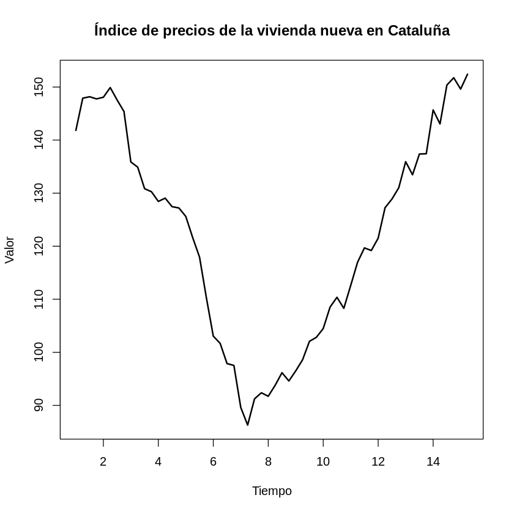
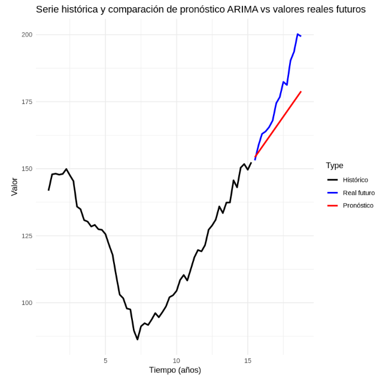
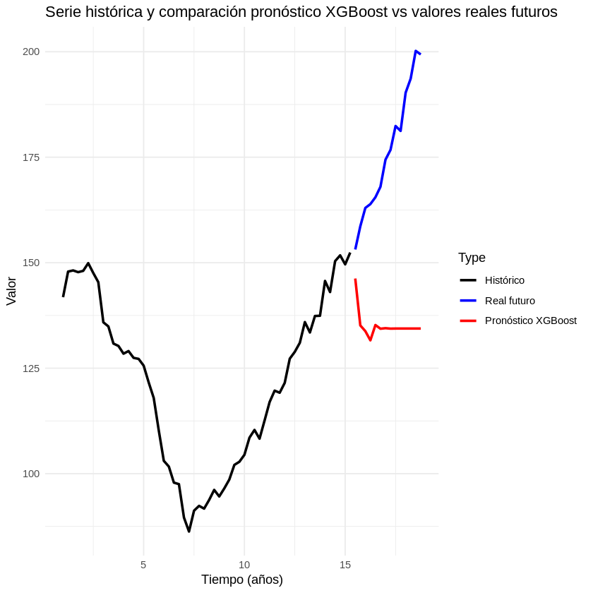
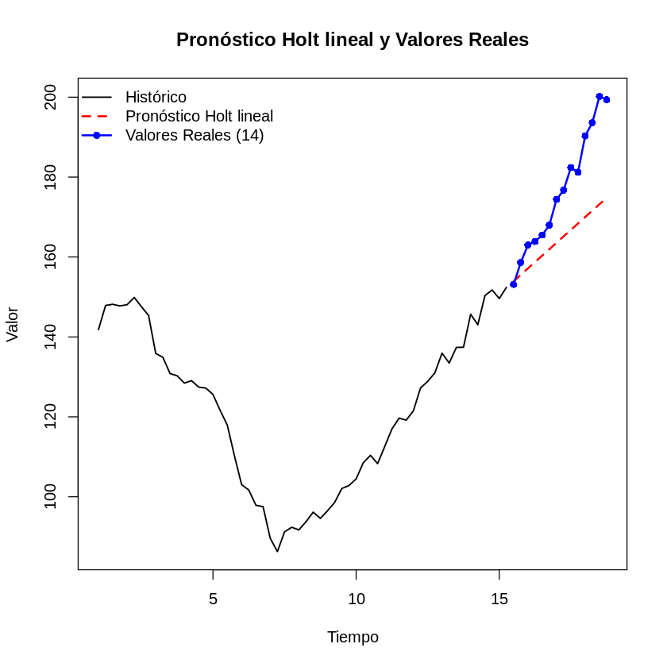
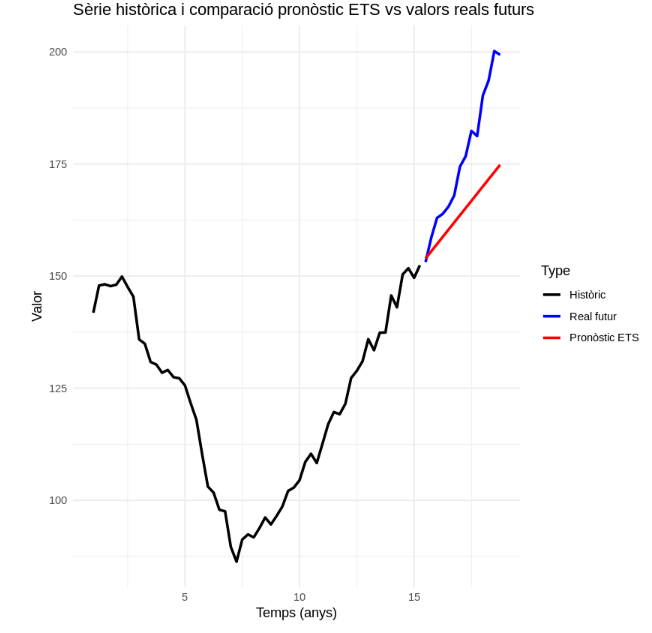

# Forecasting the Housing Price Index in Catalonia


-success)


Time-series forecasting of the **Housing Price Index (IPV) for new housing in Catalonia**, benchmarking classical statistical models against machine learning over 18 years of quarterly data (2007–2024) — a series that spans the 2008 crash, the long recovery and the post-pandemic boom.

> Final project — *Time Series & Forecasting*, MSc in Data Science, La Salle (Ramon Llull University), 2025.
> **Authors:** Ivan Betriu Kahlenberg · Marc Fort Garcia

## The question

Given 14.5 years of history, how accurately can each family of models forecast housing prices **14 quarters (3.5 years) ahead**? The series is a demanding test bench: two opposing cycles, a strong trend and no marked seasonality.



## Data

| | |
|---|---|
| **Source** | [INE — Housing Price Index (IPV), base 2015](https://www.ine.es/jaxiT3/Tabla.htm?t=25171), built from notarial deeds of actual transactions |
| **Scope** | New housing · Catalonia · index values |
| **Frequency** | Quarterly, 2007Q1 → 2024Q4 (72 observations) |
| **Split** | Train: 58 obs (2007Q1–2021Q2) · Test: 14 obs (2021Q3–2024Q4) — 80/20 |

The exact dataset used (~5 KB) is included in [`data/vivienda.csv`](data/vivienda.csv) so the whole project reproduces offline. See [`data/README.md`](data/README.md) for the data dictionary and how to pull fresh data from INE.

## Methodology

The Augmented Dickey-Fuller test confirms the series is non-stationary (p = 0.91), guiding model choice. All models are trained on the same 58 quarters and evaluated on the same 14 held-out quarters:

1. **Holt linear exponential smoothing** — deterministic benchmark for trended, non-seasonal series.
2. **ARIMA** — `auto.arima()` selects ARIMA(0,2,1).
3. **ETS** — state-space exponential smoothing; selects ETS(A,A,N).
4. **XGBoost** — 4 lagged features, recursive multi-step forecasting.

## Results

| Model | RMSE | MAE | MSE |
|---|---:|---:|---:|
| **ARIMA (0,2,1)** | **12.24** | **10.03** | **149.72** |
| Holt linear | 14.69 | 12.19 | 215.72 |
| ETS (A,A,N) | 14.69 | 12.19 | 215.72 |
| XGBoost (4 lags) | 44.41 | 41.34 | 1972.46 |

| **ARIMA (0,2,1) — best** | **XGBoost — worst** |
|---|---|
|  |  |
| **Holt linear** | **ETS (A,A,N)** |
|  |  |

## Key takeaways

- **ARIMA(0,2,1) wins** across every metric, tracking the post-2021 acceleration most closely.
- **ETS and Holt produce identical errors** — ETS(A,A,N) *is* Holt's linear method in state-space form, a reassuring internal consistency check.
- **XGBoost fails by design, not by tuning**: tree-based models cannot extrapolate beyond the range seen in training, so recursive forecasts flatten out while real prices kept climbing. A textbook illustration of why ML is not automatically better for small, strongly-trended series.
- In a real use case the simpler statistical models would be preferred: better accuracy *and* lower computational cost.

## Repository structure

```
├── data/
│   ├── vivienda.csv          # IPV new housing, Catalonia (INE) — exact data used
│   └── README.md             # data dictionary & source
├── notebooks/
│   └── Proyecto_Final_TS.ipynb   # full analysis (R kernel)
├── figures/                  # exported plots
├── reports/
│   ├── report.pdf            # written report (Spanish)
│   └── slides.pptx           # presentation (Spanish)
└── README.md
```

## Reproduce it

Requires R ≥ 4.0. The first notebook cell installs any missing packages (`forecast`, `tseries`, `xgboost`, `data.table`, `Metrics`, `ggplot2`).

```bash
# Option A — Jupyter with the R kernel (IRkernel)
jupyter notebook notebooks/Proyecto_Final_TS.ipynb

# Option B — copy the cells into RStudio and run top to bottom
```

## License

[MIT](LICENSE) — data © [INE](https://www.ine.es), reused under its [open data policy](https://www.ine.es/aviso_legal).
