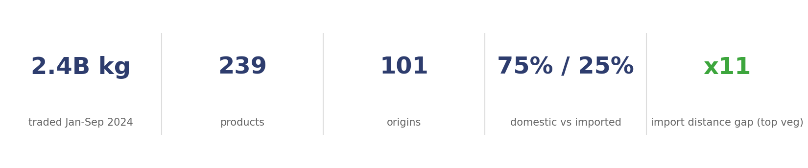
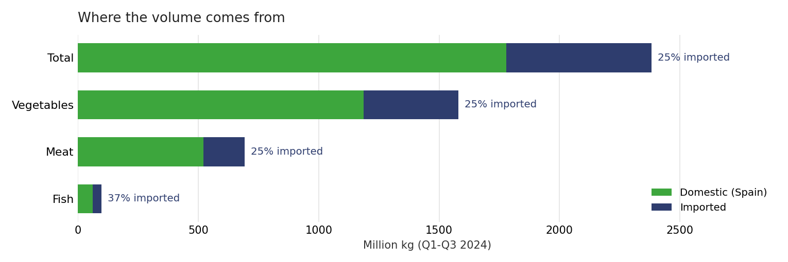
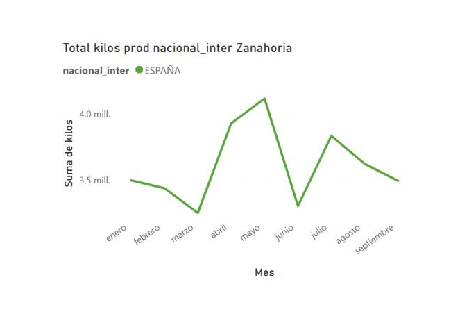
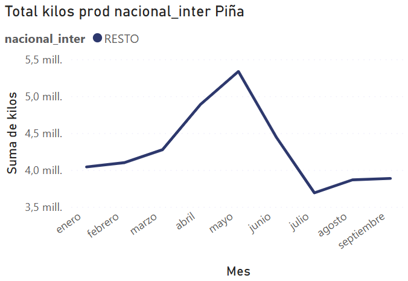
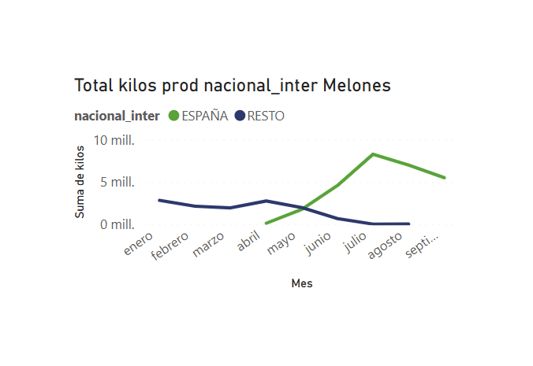
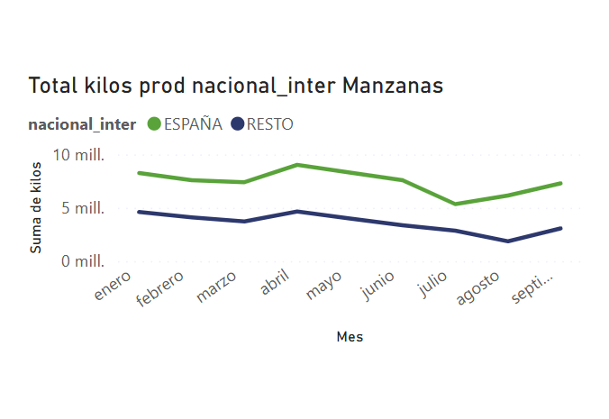
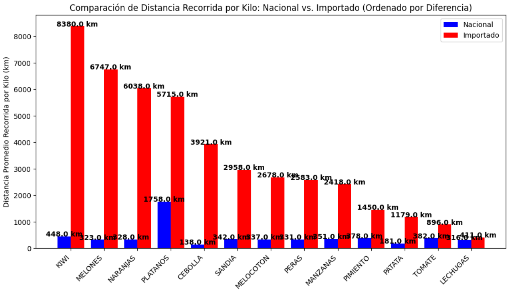
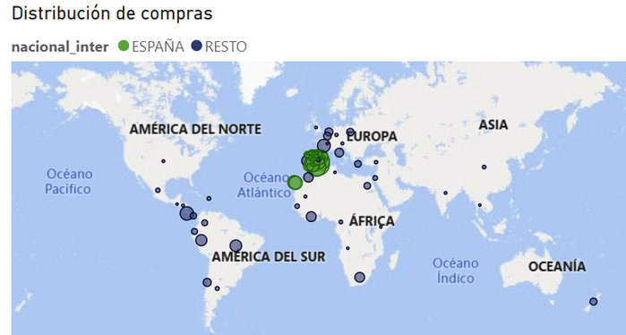

# Where Does Madrid's Food Come From?


Origin and sustainability analysis of **Mercamadrid, the largest fresh food distribution hub in Europe**. Using its 2024 open sales data (volume, price and origin of every product traded), this project measures how much of Madrid's fresh food is imported, what drives those imports, and what that means in transport distance and environmental footprint.



## The questions

1. **Import weight**: what is the real share of imports in the fresh produce supply?
2. **Seasonality**: how much does the time of year change where products come from?
3. **Logistics and distance**: how far does food travel to reach Madrid, and how different is that journey for domestic and imported products?

## Key findings

1. **Domestic supply is the backbone; imports are the safety net.** 75% of the 2.4 billion kg traded between January and September 2024 is Spanish. The remaining 25% keeps shelves stocked when national production cannot.
2. **Seasonality is the main import driver.** Melons, watermelons or oranges are imported off season, while pineapple or kiwi are imported because there is no meaningful national production. Four supply patterns emerge: exclusively domestic (carrot), exclusively imported (pineapple), counter season imports (melon) and mixed supply (apple).
3. **Within the top selling vegetables, imports travel 11 times farther.** On average, about 4,300 km more per kilo than their domestic equivalents, a heavy and largely invisible share of the supply chain's carbon footprint.
4. **Year-round availability has become the norm.** The deseasonalization of consumption consolidates import dependency: fresh produce is expected on the shelf every month, whatever the season.



*Fish is the most import dependent category; vegetables and meat hover around 25%.*

**Why focus on vegetables?** It is the largest category (66% of all kilos) and the only one with the full spectrum of origin behaviors, from exclusively domestic products (carrot) to exclusively imported ones (pineapple), which makes origin and seasonality patterns truly observable. Meat looks similar on aggregate, but its 25% import share comes almost entirely from beef: pork, chicken and turkey are virtually 100% Spanish. The product level analysis covers the 14 top selling vegetable categories, more than half of all vegetable kilos sold.

### Four supply patterns

| **Always domestic: carrot** | **Always imported: pineapple** |
|---|---|
|  |  |
| **Counter season imports: melon** | **Mixed supply: apple** |
|  |  |

*Monthly kilos by origin (green: Spain, navy: imported). Every top vegetable falls into one of these four patterns. Melon is the clearest case of imports stepping in exactly when national production stops: year-round availability, at a cost.*

### The cost of distance



*Same product, two journeys: average distance per kilo for the domestic (blue) and imported (red) version of each top vegetable, sorted by the gap. Across these products, imports travel on average 11 times farther, about 4,300 km more per kilo.*

## The dashboard

Seven interactive Power BI pages: general overview, meat vs vegetables vs fish comparison, volume analysis and four product level deep dives that expose the seasonal import patterns.



*Purchase distribution by origin, from the dashboard: green is Spain, navy is the rest of the world. Open [`powerbi/Mercamadrid.pbix`](powerbi/Mercamadrid.pbix) in Power BI Desktop to explore it.*

## How it is built

```
volpre2024 (open data) -> Python: cleaning + categorization -> GeoPy geocoding + Haversine distances -> Excel -> Power BI
```

- [`notebooks/01_cleaning_transformation.ipynb`](notebooks/01_cleaning_transformation.ipynb): cleans 27,571 monthly records with pandas (type fixes, duplicated headers, price normalization) and builds the analysis categories: product groups, general typology (vegetables, meat, fish) and the domestic vs imported flag.
- [`notebooks/02_geocoding_distances.ipynb`](notebooks/02_geocoding_distances.ipynb): geocodes the 101 origins with GeoPy (Nominatim), builds geometries with GeoPandas and computes each origin's distance to Madrid with the Haversine formula.
- [`powerbi/Mercamadrid.pbix`](powerbi/Mercamadrid.pbix): the interactive dashboard built on the processed dataset.
- [`reports/article.pdf`](reports/article.pdf): four page write-up of the study (Spanish). [`reports/slides.pptx`](reports/slides.pptx): final presentation (Spanish).

## Repository structure

```
├── data/
│   ├── mercamadrid.xlsx      # processed dataset, 27,571 rows x 16 columns
│   └── README.md             # data dictionary & source
├── notebooks/
│   ├── 01_cleaning_transformation.ipynb
│   └── 02_geocoding_distances.ipynb
├── powerbi/
│   └── Mercamadrid.pbix      # 7 page interactive dashboard
├── figures/                  # charts used in this README
├── reports/
│   ├── article.pdf           # written study (Spanish)
│   └── slides.pptx           # presentation (Spanish)
├── requirements.txt
└── README.md
```

## Data

| | |
|---|---|
| **Source** | [Mercamadrid: volumen y precio, Madrid City Council open data portal](https://data.europa.eu/data/datasets/https-datosmadrid-es-egob-catalogo-300357-0-mercamadrid-volumen-precio) (raw file `volpre2024.csv`) |
| **Scope** | Volume (kg), prices (EUR/kg) and geographic origin of every product traded, January to September 2024 |
| **Processed dataset** | [`data/mercamadrid.xlsx`](data/mercamadrid.xlsx), the output of notebook 01 used by the dashboard |
| **Dictionary** | [`data/README.md`](data/README.md) |

*Personal data analytics project. Author: Ivan Betriu Kahlenberg.*
