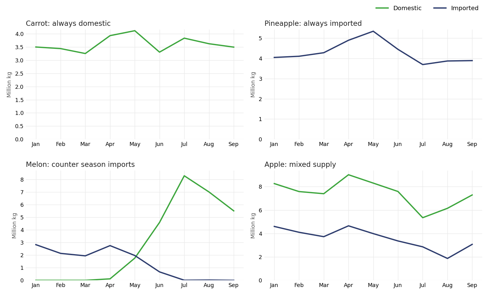

# Where Does Madrid's Fresh Food Come From?


Mercamadrid is **the largest fresh food hub in Europe**: if you buy fresh produce in Madrid, there is a good chance it passed through here. The market publishes monthly open data on what it sells (kilos, prices and origin, product by product), so I took the 2024 figures and followed the trail: how much of what Mercamadrid sells is imported, why, and what those imports cost in kilometers.


## The questions

1. **Import weight**: what is the real share of imports in the fresh produce supply?
2. **Seasonality**: how much does the time of year change where products come from?
3. **Logistics and distance**: how far does food travel to reach Madrid, and how different is that journey for domestic and imported products?

## What the data says

### 1. Three quarters of the volume is Spanish

Mercamadrid buys from 101 origins all over the world, but most of the volume never crosses a border.


*Purchase distribution map: green is Spain, navy the rest of the world.*

Domestic supply is the backbone: 75% of the 2.4 billion kg traded between January and September 2024 comes from Spain, and the remaining 25% keeps shelves stocked when national production cannot. The split barely moves across categories, with one exception:


*Fish is the most import dependent category; vegetables and meat hover around 25%.*

**Why focus on vegetables?** It is the largest category (66% of all kilos) and the only one with the full spectrum of origin behaviors, from exclusively domestic products (carrot) to exclusively imported ones (pineapple), which makes origin and seasonality patterns truly observable. Meat looks similar on aggregate, but its 25% import share comes almost entirely from beef: pork, chicken and turkey are virtually 100% Spanish. The product level analysis covers the 14 top selling vegetable categories, more than half of all vegetable kilos sold.

### 2. Seasonality drives the imports

Melons, watermelons or oranges are imported off season, while pineapple or kiwi are imported because there is no meaningful national production. Every top selling vegetable falls into one of four supply patterns:



*Monthly kilos by origin. Melon is the clearest case of imports stepping in exactly when national production stops: year-round availability, at a cost.*

### 3. Imported products travel 11 times farther

Across the top selling vegetables, an imported kilo travels on average 11 times farther than its domestic equivalent, about 4,300 km more: a heavy and largely invisible share of the supply chain's carbon footprint.


*Same product, two journeys: average distance per kilo for the domestic (green) and imported (navy) version of each top vegetable sold with both origins, sorted by the gap.*

**The bottom line:** year-round availability has become the norm. The deseasonalization of consumption consolidates import dependency: fresh produce is expected on the shelf every month, whatever the season, and the kilometers travel with it.

## How it is built

```
volpre2024 (open data) -> Python: cleaning + categorization -> GeoPy geocoding + Haversine distances -> Excel -> Power BI
```

- [`notebooks/01_cleaning_transformation.ipynb`](notebooks/01_cleaning_transformation.ipynb): cleans 27,571 monthly records with pandas (type fixes, duplicated headers, price normalization) and builds the analysis categories: product groups, general typology (vegetables, meat, fish) and the domestic vs imported flag.
- [`notebooks/02_geocoding_distances.ipynb`](notebooks/02_geocoding_distances.ipynb): geocodes the 101 origins with GeoPy (Nominatim), builds geometries with GeoPandas and computes each origin's distance to Madrid with the Haversine formula.
- [`powerbi/Mercamadrid.pbix`](powerbi/Mercamadrid.pbix): the interactive dashboard built on the processed dataset, seven pages covering the general overview, meat vs vegetables vs fish, volume analysis and four product deep dives. Open it in Power BI Desktop.
- [`reports/article.pdf`](reports/article.pdf): four page write-up of the study (Spanish). [`reports/slides.pptx`](reports/slides.pptx): final presentation (Spanish).

## Repository structure

```
├── data/
│   ├── mercamadrid.xlsx      # processed dataset, 27,571 rows x 16 columns
│   └── README.md             # data dictionary & source
├── notebooks/
│   ├── 01_cleaning_transformation.ipynb
│   └── 02_geocoding_distances.ipynb
├── powerbi/
│   └── Mercamadrid.pbix      # 7 page interactive dashboard
├── figures/                  # charts used in this README
├── reports/
│   ├── article.pdf           # written study (Spanish)
│   └── slides.pptx           # presentation (Spanish)
├── requirements.txt
└── README.md
```

## Data

| | |
|---|---|
| **Source** | [Mercamadrid: volumen y precio, Madrid City Council open data portal](https://data.europa.eu/data/datasets/https-datosmadrid-es-egob-catalogo-300357-0-mercamadrid-volumen-precio) (raw file `volpre2024.csv`) |
| **Scope** | Volume (kg), prices (EUR/kg) and geographic origin of every product traded, January to September 2024 |
| **Processed dataset** | [`data/mercamadrid.xlsx`](data/mercamadrid.xlsx), the output of notebook 01 used by the dashboard |
| **Dictionary** | [`data/README.md`](data/README.md) |

*Personal data analytics project. Author: Ivan Betriu Kahlenberg.*
