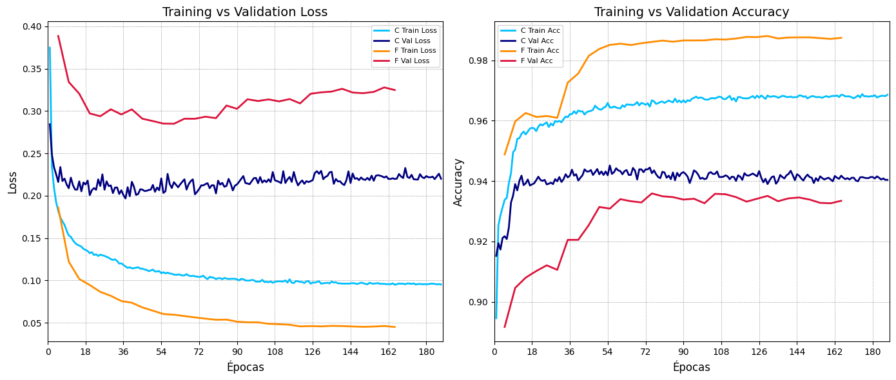
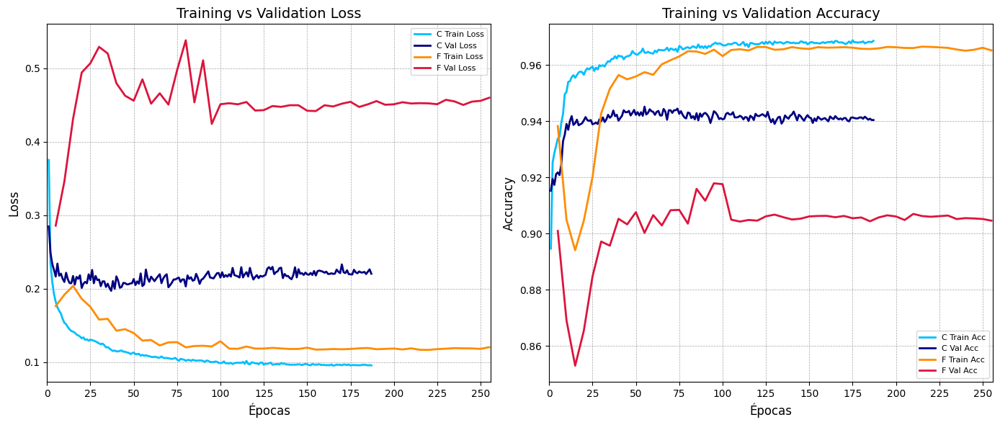
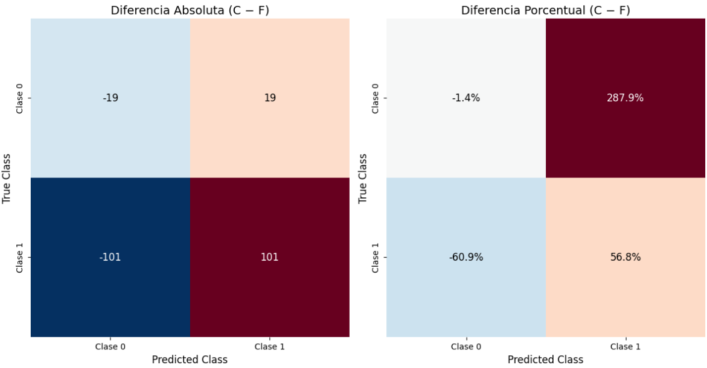

# Federated vs Centralized Learning: Epileptic Seizure Detection

A comparative study of federated and centralized machine learning for binary classification of epileptic seizures from EEG signals, framed around privacy-preserving training under EU data regulation.

Master's Thesis — M.Sc. Data Science, La Salle (Universitat Ramon Llull), 2025. Mentored by T-Systems.

## Why this matters

Healthcare data is among the most sensitive and fragmented data there is. Hospitals cannot freely share patient records, yet machine learning models need large datasets to perform well. Federated Learning offers a way out: train a shared model collaboratively without ever centralizing the raw data.

This project measures the real cost of that privacy gain. How much performance do we lose, and where exactly does federated training break down?

## The experiment

**Dataset:** Epileptic Seizure Recognition — 11,500 EEG signal windows (178 features each), binary classification: seizure vs. non-seizure.

**Models:**

- MLP (Multi-Layer Perceptron), Binary Cross-Entropy loss
- Linear SVM (SGD classifier), Hinge loss

**Four configurations, each run under both training paradigms:**

| Configuration | Model | Data distribution | Loss |
|:---:|:---:|:---:|:---:|
| 1 | MLP | IID | Binary Cross-Entropy |
| 2 | MLP | Non-IID | Binary Cross-Entropy |
| 3 | SVM | IID | Hinge |
| 4 | SVM | Non-IID | Hinge |

- **Centralized:** single-node training, up to 1,000 epochs, early stopping (100 epochs patience).
- **Federated:** 10 clients, FedAvg aggregation, up to 200 rounds with early stopping.
- **IID:** data split randomly and balanced across clients.
- **Non-IID:** data split via Dirichlet distribution (α=0.5) to create realistic heterogeneity.
- Each configuration averaged over **5 independent runs** (seeds 42–46).

## Key findings

### 1. In IID, federated matches centralized almost exactly

| Setup | Accuracy | Loss | Precision | Recall | ROC-AUC |
|:---|:---:|:---:|:---:|:---:|:---:|
| Centralized | 0.948 | 0.192 | 0.916 | 0.812 | 0.948 |
| Federated IID | 0.941 | 0.233 | 0.928 | 0.764 | 0.939 |
| Federated Non-IID | 0.900 | 0.737 | 0.970 | 0.518 | 0.819 |

When data is identically distributed across clients, the federated MLP tracks the centralized model closely. The cost of decentralization is small — the gap is real but modest.



*IID. Federated (orange/red) and centralized (cyan/navy) converge to nearly the same validation accuracy. The federated validation curve sits slightly lower and noisier, but the gap is small.*

### 2. Heterogeneity slows convergence and widens the gap

Under Non-IID data, the federated model converges more slowly and far less stably. Validation loss stays high and oscillates for the first ~100 rounds before settling, while the centralized model is already stable. Convergence speed is, in effect, proportional to how heterogeneous the clients are.



*Non-IID. The federated validation loss (red) spikes and oscillates early before stabilizing, and final validation accuracy plateaus below the centralized run. The instability is the heterogeneity cost made visible.*

### 3. Federated training develops a majority-class bias — and misses seizures

The most important finding. Federated training systematically favors the majority class (non-seizure), which collapses recall on the class that actually matters clinically. The Non-IID federated MLP dropped recall to **0.518** — nearly half of real seizures missed — while still posting 0.90 accuracy thanks to class imbalance. Accuracy hides the failure; recall exposes it.



*Difference between centralized and federated confusion matrices (Non-IID). The federated model misclassifies **101 more seizure cases** as non-seizure than the centralized one (−60.9% on the seizure row). In a diagnostic setting these are missed diagnoses.*

### 4. The generalization gap is inherent to federation, not just to Non-IID

Even in the IID scenario the train-to-validation gap is wider for the federated model than for the centralized one. This points to the FedAvg aggregation step itself introducing a generalization penalty, beyond what data heterogeneity explains.

### 5. SVM underperformed regardless of paradigm

Both centralized and federated linear SVM landed near random (ROC-AUC ≈ 0.52–0.56), so the linear model simply could not capture the EEG patterns. Because the classifiers are essentially at chance, the apparent federated-vs-centralized differences here are not meaningful and are reported for completeness only.

| Setup | Accuracy | Loss | Precision | Recall | ROC-AUC |
|:---|:---:|:---:|:---:|:---:|:---:|
| Centralized | 0.703 | 0.500 | 0.580 | 0.471 | 0.518 |
| Federated IID | 0.845 | 0.506 | 0.746 | 0.361 | 0.525 |
| Federated Non-IID | 0.838 | 0.492 | 0.669 | 0.405 | 0.557 |

## Quick start

```bash
pip install -r requirements.txt
```

Open `federated_vs_centralized.ipynb` and run it top to bottom. Each configuration calls `run_simulation()` with the appropriate parameters; results are saved as JSON and plots are generated inline.

> A full configuration (5 runs × up to 200 rounds) takes roughly 15–30 min depending on hardware. Flower uses Ray internally for client simulation.

**Dataset:** download the [Epileptic Seizure Recognition dataset](https://www.upf.edu/web/ntsa/downloads/-/asset_publisher/xvT6E4pczrBw/content/2012-nonrandomness-nonlinear-dependence-and-nonstationarity-of-electroencephalographic-recordings-from-epilepsy-patients) and place `Epileptic Seizure Recognition.csv` next to the notebook.

## Tech stack

- Python 3.10+
- PyTorch — model implementation (MLP and linear SVM via gradient descent)
- Flower (flwr) — federated learning simulation (FedAvg strategy)
- scikit-learn — preprocessing, Platt-scaling calibration for SVM, metrics
- Pandas / NumPy — data handling
- Matplotlib / Seaborn — training curves and confusion-matrix figures

## Project structure

```
├── federated_vs_centralized.ipynb   # Full experiment: all 4 configurations + aggregation
├── requirements.txt                 # Python dependencies
├── assets/                          # Figures used in this README
└── README.md
```

The notebook is organized in 15 sections: imports and global config (1–2), model and loss definitions (3–4), data loading and IID/Dirichlet partitioning (5), Flower components with early stopping (6), centralized training and test evaluation (7–8), visualization utilities (9), the `run_simulation()` orchestrator (10), the four execution blocks (11–14), and cross-run aggregation (15).

## Regulatory context

The work is framed within the **EU Data Strategy (2021–2027)**, looking at how federated learning aligns with the Data Governance Act, the Data Act, and GDPR requirements for privacy-preserving analysis across institutions.

## Limitations and future work

- Models are intentionally simple: the goal was comparing training paradigms, not maximizing raw performance.
- Only FedAvg was tested; aggregation variants (FedProx, SCAFFOLD, FedMA) could mitigate the gaps found here.
- A single dataset was used; cross-domain validation would strengthen the conclusions.
- Class-imbalance mitigation in federated settings remains unexplored and is the most promising next step given finding 3.

---

**Ivan Betriu Kahlenberg**

[](https://www.linkedin.com/in/ivan-betriu-kahlenberg)
